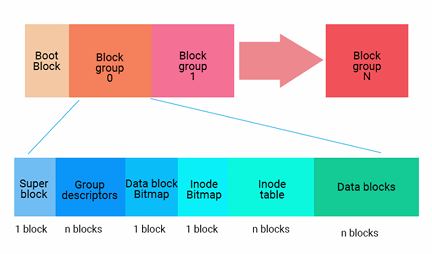

# Computer forensic
## 1. Essential Basics 
1. Computer Forensic   
Not focus on the term itself, but how to conduct it.    
    1. Acuisition
    2. Analysis 
    3. Report 

        

2. Digital Evidence
Any data that is preserved in a computer system that can be read or understand by a person or computer system/applications.    

    

3. Metadata vs Data

4. Data Volatility

5. File System

    |File System|Construction|
    |-|-|
    |FAT||
    |FAT32||
    |exFAT||
    |APFS||
    |EXT||
    |NTFS||

6. Disk Drive Anatomy

    1. Hard Disk Drive 

        

    2. HDD vs Solid State Disk

        

    3. SSD is tougher to restore because these is a protocol called TRIM which will force the invalid zone clear first.

## 2. Windows Forensic
1. Need to know
    1. Important files location   
    Normally the important files are stored at `C:\Windows\System32`, files include `wininit.exe`, `svchost.exe` and so on.

    2. Auto starts registries 
    
        

    3. Hidden files   
        * Impersonate names of legitimated files   
            * A:1sass.exe B:lsass.exe   
            * A: dllhost.exe B: dIIhost.exe   
            * A: EXPLORER.EXE B: EXPL0RER.EXE
        
        * Hidden by malicious users   
            Can use   
                

    4. Alternate Data Streams

    5. Prefetch   
        * Maintains a list of used programs.
        * Used to decrease the amount of time to open a program.   
        * **Location:** `C:\Windows\Prefetch`
        * **File Format:** `filename.pf` -> proprietary format
        * Tool to read pf file: `pecmd.exe`

    6. Signed or Not   
    Use `Sigcheck`

2. Timeline Analysis   
    1. Corresponded Actions

        
    2. Letter Connotation
        |M|Last Modified|
        |-|-|
        |A|Last Accessed|
        |C|Meta data changes|
        |B|When the file was created|

3. Windows Registry Analysis
    1. NTUSER.DAT   
        Settings specific to individual users. Tracks users activity and preferences.

        1. MUICache: Show software which has been executed on a system.
        2. MRU: Show software which is most recently used.

    2. SAM   
    Only applicable to local or domain administrators. Contains user name, SID and encrypted password hash for all users in a domain.

    3. Security   
    Contains the security permissions for administrators. Used by the system to enforce security policy. Limited usefulness for forensics.

    4. Software   
    Contains programs and Windows settings for all software on the system.

    5. System    
    Contains Windows OS setup, mounted devices, hardware settings and services.