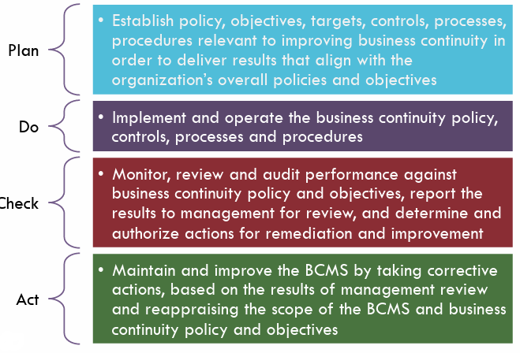

# Contingency Planning and Management

## 1. Contingency planning
1. Aiming: To cope with some circumstances that normal operations are infeasible.

2. Why we need contingency plan?   
    * Every system is ***imperfect***.
    * There are always ***emergencies***.
    * Legal ***obligation***.

## 2. Multiple response paradigm
1. Taxnology of contingencies
    |Name|Definition|
    |-|-|
    |Emergency|***Time critical***, something time critical which needs quick response to reduce damage/losses of people’s life, physical or information assets.|
    |Cirsis|***strategic***, A situation with potential knock-on and long term adversarial effects, affecting reputation, stock prices/market, etc.|
    |Disaster|***Physical damage***,  Involves loss of physical assets and/or people’s life/health, and/or critical IT systems.|

2. Business Contiguity Management   
   1. **Definition**: Business Contiguity Management, namely `BCM`, is broadly defined as a business process that seeks to ensure organizations are able to withstand any disruption to normal functioning.

    2. Steps:   
        1. Emergency response
        2. Crisis management
        3. Business recovery

    3. The life cycle of BCM   
        

3. Business Continuity Planning
    1. Process   
        1. BIA & RA
        2. BC strategy fomulation
        3. BCP production (BCP namely is Business Continuity Planning)
        4. BCP testing
        5. BCP awareness
        6. Ongoing BCP maintainance

    2.  PDCA (Plan, Do, Check, Act)   
    It is an iterative four step management method used in business for the control & continuous improvement of processes and products.    

        
