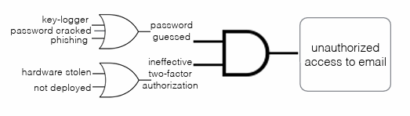

# Risk Analysis and Assessment
First thing first, differences between risk, threat and vulnerabilities.   
|Terminology|Definition|
|-|-|
|Vulnerabilities| Weakness of an asset or control that can be exploited by one or more threats |
|Threat| Potential cause of an unwanted incident, which may result in harm to a system or organisation|
|Risk|Effect of uncertainty on objectives|   

&nbsp;

## 1. Dilemmas for information security
1. `Powerful attacking resource` VS `inadequate security budget`   
You don't know how much attack resources the adversaries have, so it's hard to decide how much you should pay for security. And sometimes, there are some nation state attackers, they have way more attacking resource than you could defend.
2. `Complacency`   
Even if you deploy your defenses. You don't know whether the security is brought by your defenses techniques or just because the attackers haven't attacked you.
3. `Compliance out of compulsion`
4. `The fallacy of relative privation`   
You might also be attacked even you are more secure than other guys or companies.   

So the conclusion is, information security shouldn't be driven by `Fear`, `Uncertainty`, `Doubt`.

## 2. Risk Analysis
Find the assets you need to secure, maximize the protection while providing functionality.   
***Risk management is for different valuable assets, you need to investigate the logical and system boundary.***

1. Multi-tier Risk Management

    

2. Risk Analysis Process   

    1. Information gathering

    2. Vulnerability analysis

        

    3. Categorize vulnerabilities -> `Severity` & `Exposure`

        

    4. Threat analysis
        * Human Threat
        * Non-Human Threat

    5. Risk identification and analysis of acceptable risks

        

3. Risk Management Framework
    1. Categorize information system 
    2. Select security controls
    3. Implement security controls
    4. Assess security controls
    5. Authorize information system
    6. Monitor security controls   

        

4. `Qualitative` VS `Quantitative` analysis
    * Quantitative is better than qualitative analysis at the most of time.   

    ||Pros|Cons|
    |-|-|-|
    |Qualitative|<ol><li>Simple to use</li><li>Flexible</li><li>Cover a lot of ranges</li> </ol>|<ol> <li>Ambiguous</li></ol>|
    |Quantitative|<ol> <li>easy to convince</li><li>Support budget decision</li><li>derived from irrefutable facts</li>  </ol>|<ol><li>Inapplicable(hard to generate></li><li>false sense of accuracy</li></ol>|   

    * ***Useful tool***: Annualized Loss Expectancy -> ALE   

    * ***Shortcomings of ALE***:   

        1. Cannot distinguish high-frequency, low-impact events from low frequency, high-impact events based on such a single simplified number.   
        2. False sense of accuracy.
        3. Not flexible.

## 3. Actualize Risk Analysis
1. Fault Tree Analysis (FTA)   
Using a series of lower-level events to deduct the final undesired event.   

    

2. Attack Trees   
    1. Root nodes: unwanted events   
    2. Leaf nodes: attacks and the consequences

        

3. Event Tree Analysis (ETA)     
Explores forward (success/failure) responses through a single initiating event. Lays a path for assessing probabilities of various outcomes.

4. Failure Mode & Effect Analysis (FMEA)   
    * ***probability*** that failure will occur.
    * likelihood that failure won't be ***detected***.
    * ***severity*** of effects of the failure.

    All those three -> Risk Priority Number (RPN) = $prob*det*sev$

## 4. Conclusion
Since we don't have infinite budget, we need to know where should we invest the money and the priorities of those places. That's why we need `Risk Analysis`.   

To conduct this `Risk Analysis`, we need to know the process of it and what tools can we use, like FTA, ETA, FMEA etc.

